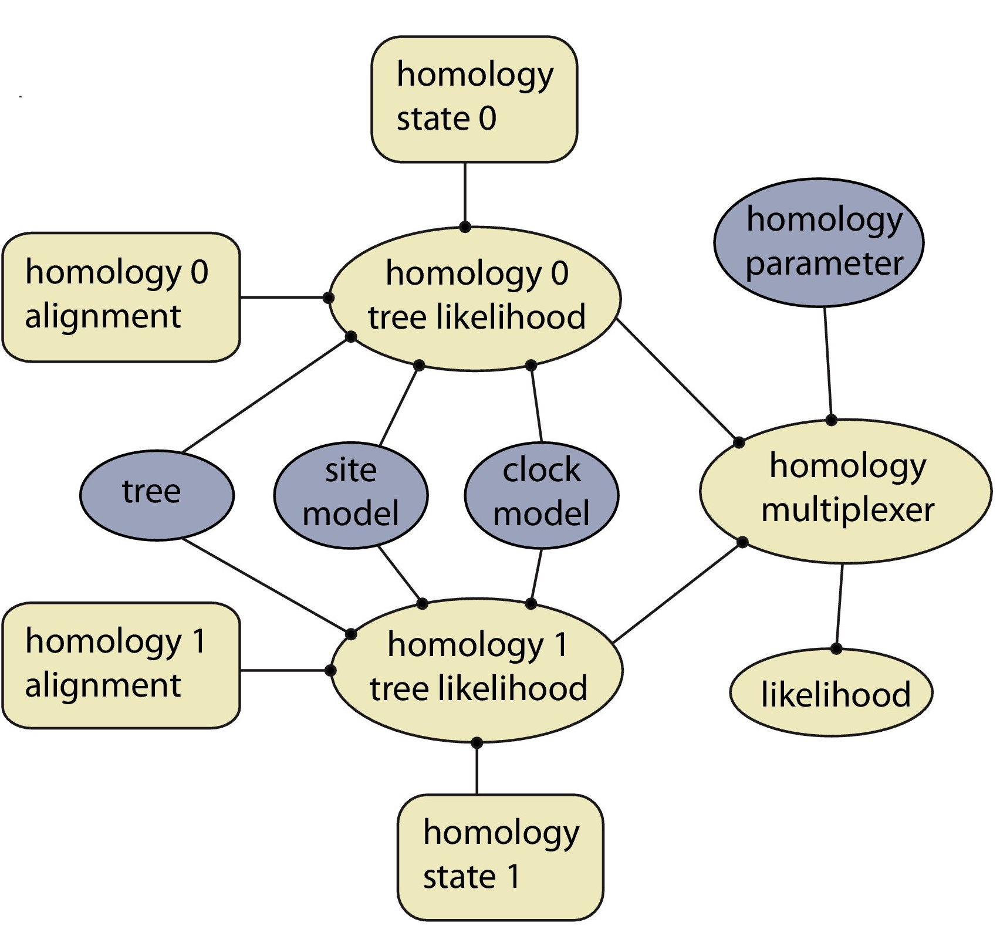

# homology
BEAST2 package for dynamic homology of morphological characters.

This package is associated with the following publication:
King, B. and Rücklin, M. (2020). [A Bayesian approach to dynamic homology of morphological characters and the ancestral phenotype of jawed vertebrates ](https://peerj.com/articles/9368/). eLife:e62374.

The package implements a model in which alternative alignments (homology alignments) corresponding to different conjectures of morphological homology are selected during the MCMC, based on a free homology parameter.

Installing package manually
---------------------------
Ensure dependencies (beast2, BeastLabs and SA) are installed, at least beast2.v2.6.0 and SA.v2.0.2.
Download the zip file from [releases](https://github.com/king-ben/homology/releases). Copy this zip file to the BEAST addon directory in your computer and unzip it. To find out where the addon directory is, open beauti, File - manage packages, click on the question mark in the bottom right corner. You may also need to clear the beast class path. This is possible in the file menu of beauti.

Building package from source
----------------------------
Ensure Apache Ant is installed.
To build this package from source, download the source code and unzip the folder. In terminal, navigate to the archive and type "ant"
This will create a "dist" folder inside the archive, within which is a zip file containing the package.
Then install this folder manually as above.
You may need to build the dependencies (beast2, BeastLabs and SA) from source first.

Archive Contents
----------------

* `README.md` : this file
* `build.xml` : Ant build script
* `/examples` : Example beast2 xml files
* `/src` : source files. See below for details.
* `version.xml` : BEAST package version file.
* `/paper_supplementary_information` : data, analysis code and processing scripts for the publication

The Java packages in the homology BEAST2 package are:

### `beast.evolution.likelihood`
* 'HomologyTreeLikelihood' - Identical to TreeLikelihood in beast2 core, but has the additional input of a homology state.
* 'HomologyMultiplexer' - A simple multiplexer which passes the value of the HomologyTreeLikelihood linked to the current homology state (determined by an integer homology parameter, which is estimated).

### `beast.evolution.operators`
* 'HomologySAExchange' - Identical to SAExchange in the SA package, but changes the homology state at the same time as topology (similar in concept to an UpDown operator).
* 'HomologySAWilsonBalding' - Identical to SAWilsonBalding in the SA package, but changes the homology state at the same time as topology (similar in concept to an UpDown operator).
* 'GibbsHomologyOperator' - For conditioning on a particular distribution for the homology parameter (e.g. state 0:0.2, state 1:0.8). As yet unused and probably not advised. 
